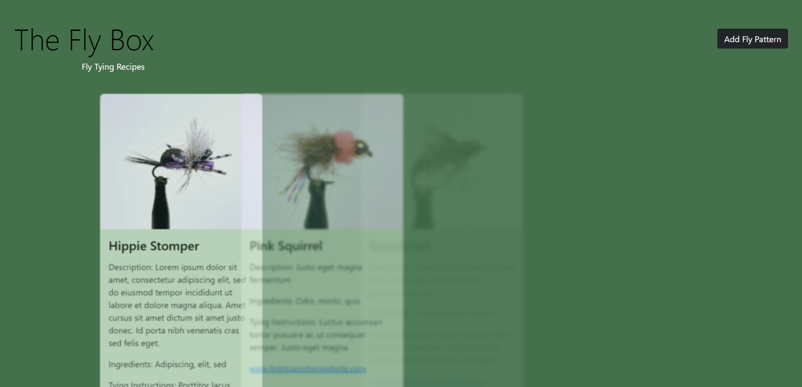
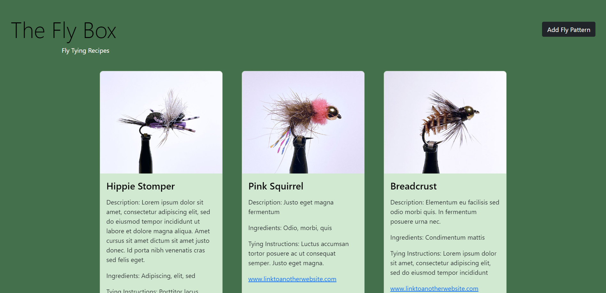
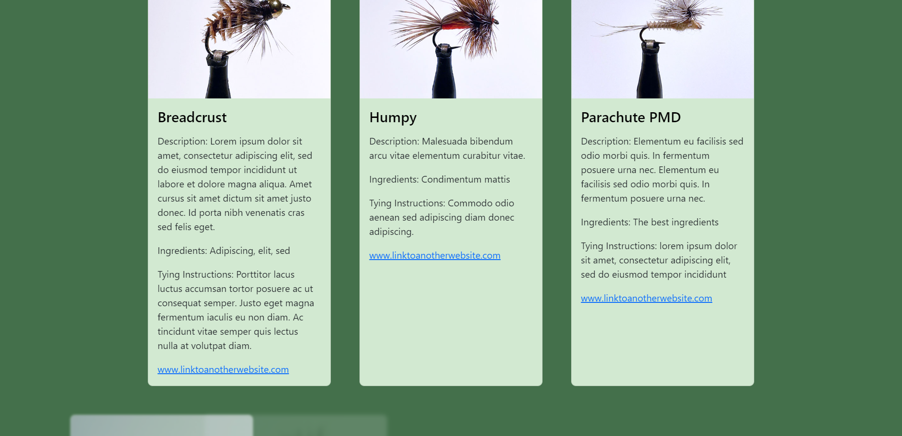
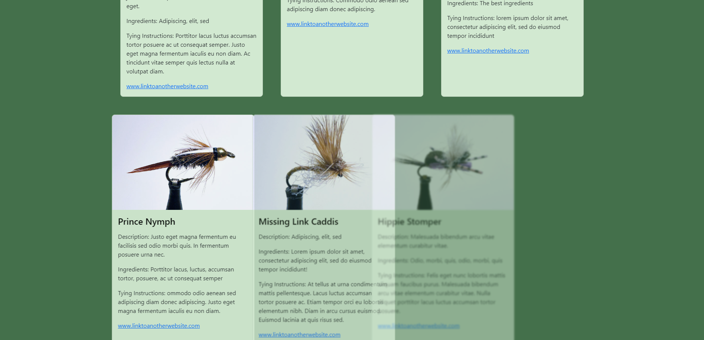
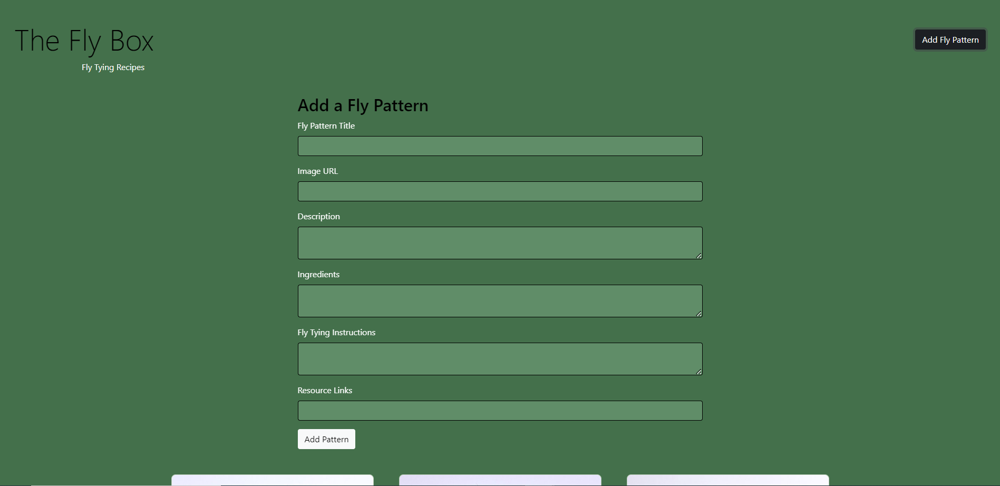
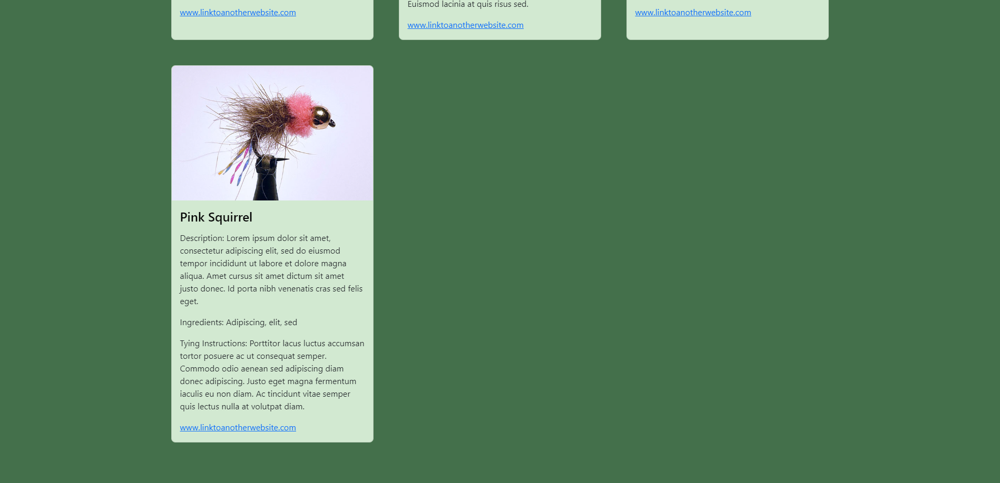
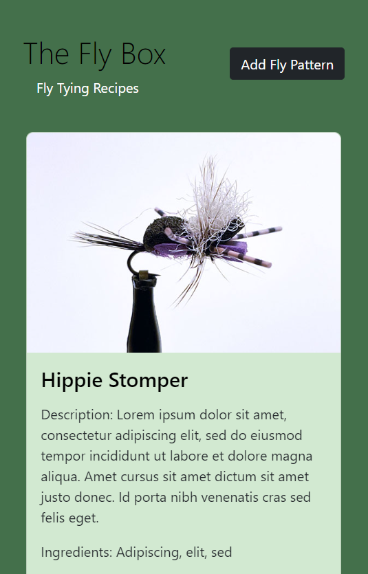
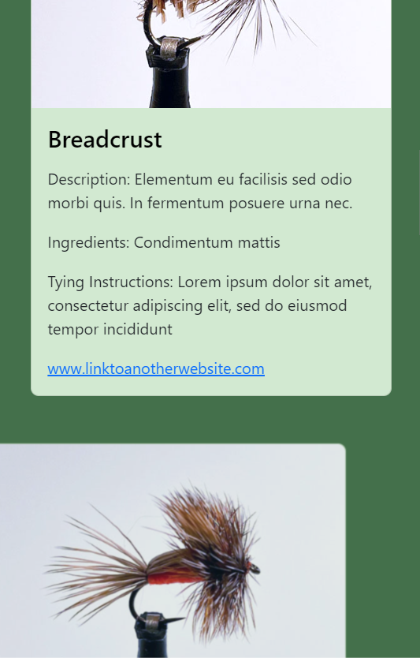
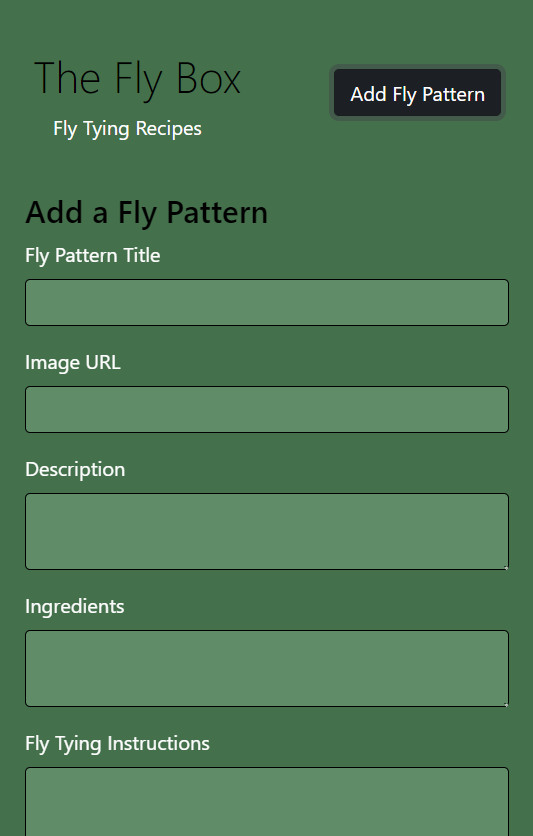

# TheFlyBox
The Fly Box

The purpose of this app is to document fly tying patterns (recipes) used in fly fishing. The user views a catalog of recipe cards and can add new recipe patterns to the page.

This app utilizes Bootstrap and features scroll animation, card display dependent on viewport size, form processing, and array processing.

Upon transitioning from a mobile-first layout to a larger screen:

- Indentation on the page sub-header transitions smoothly over 1.5 seconds.
- Card display transitions from 1 card to 3 cards.
- Card width transitions smoothly over 1.5 seconds.

Desktop walkthrough:

1. Page opens to animated cards moving onto the screen.

2. As the user scrolls further down, the cards move onto the screen as they intersect the viewport.

3. To add a new card, the user clicks the Add Fly Pattern button.

4. After filling in recipe information, the user clicks Add Pattern, the form collapses, and the new card appears at the bottom of the screen.

Mobile UI

